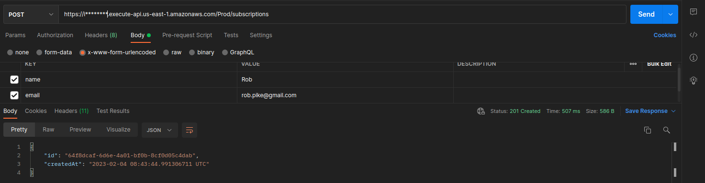

## Actix Web on Lambda

### Lambda & API Gateway with AWS SAM

Deploy your application with [AWS SAM](https://docs.aws.amazon.com/serverless-application-model/latest/developerguide/what-is-sam.html), using [SAM CLI](https://docs.aws.amazon.com/serverless-application-model/latest/developerguide/install-sam-cli.html). Have a look at a sample role you will want to create and assign to your user.
```json
{
    "Version": "2012-10-17",
    "Statement": [
        {
            "Effect": "Allow",
            "NotAction": [
                "iam:*",
                "organizations:*",
                "account:*"
            ],
            "Resource": "*"
        },
        {
            "Effect": "Allow",
            "Action": [
                "iam:CreateServiceLinkedRole",
                "iam:DeleteServiceLinkedRole",
                "iam:ListRoles",
                "iam:ListPolicies",
                "organizations:DescribeOrganization",
                "account:ListRegions"
            ],
            "Resource": "*"
        },
        {
            "Effect": "Allow",
            "Action": "iam:*",
            "Resource": "arn:aws:iam::37********43:role/microservice-*-MicroServiceLambdaRole*"
        }
    ]
}
```
Its core has been taken from AWS-managed PowerUser. We are just assigning some additional IAM perms wih regard to concrete lambda resource.
In case you are operating on a limited scope of resource, you will want to cap those permissions, adhering to the principle of least privilege.

Upon AWS credentials setup, run
```
make build
make package
make deploy
```

Get the API Gateway endpoint from the outputs sections in stdout and hit the `/subsriptions` POST with urlecoded form data:
 <br>
Note that in case of lambda's cold-start, the latency may reach 1.5 seconds. Subsequet calls will (should) be much faster.

### Important

Do not forget to clean up with `make destroy` to avoid unwanted costs. Alternatively, you can delete the stack via AWS Console (CloudFormation service).
